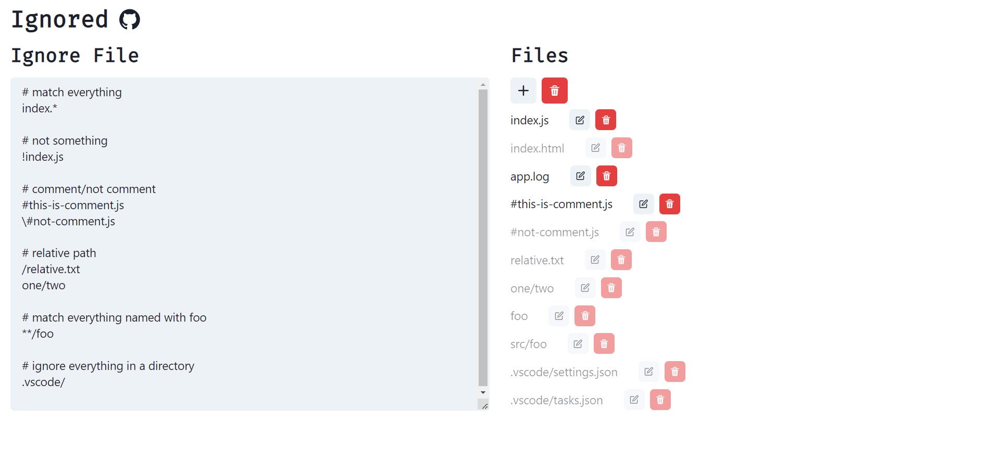

# [ignored](https://ascodeasice.github.io/ignored/)

A website to check if certain file name is ignored by .ignore file

[Try it now](https://ascodeasice.github.io/ignored/)

## How to use

1. Enter the Ignore file (`.gitignore`, `.dockerignore`) content in the left textarea.
2. Create new file name by clicking the right button
3. If the file is :

- black: not ignored
- gray: ignored
- red: invalid(start with slash/it's empty ...)

## Credits

- Uses the [node-ignore](https://github.com/kaelzhang/node-ignore)'s ignoring logic. You can further reference its syntax to use this website.
- Built with React, Chakra UI, Vite

## Screenshots

